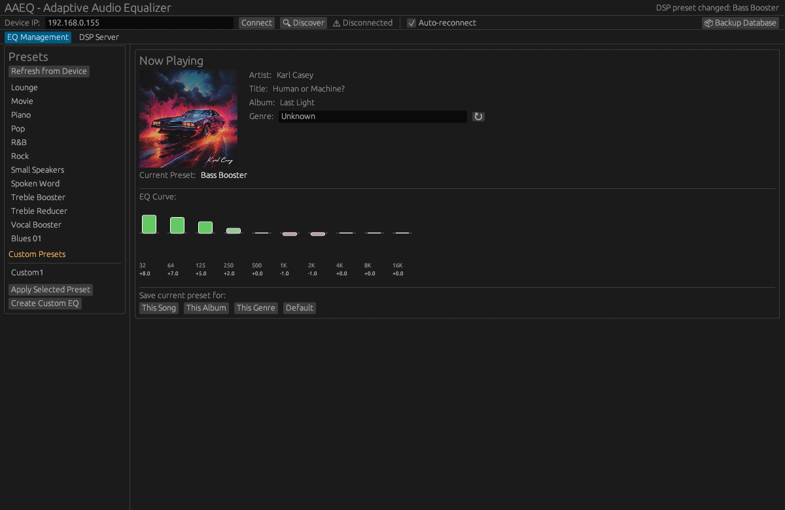

# AAEQ - Adaptive Audio Equalizer

[](https://github.com/jaschadub/AAEQ/actions)
[](LICENSE)

**Automatically apply per-song, album, or genre EQ presets to your network audio devices. Stream your computer's audio with real-time DSP processing.**

AAEQ is a cross-platform desktop application that intelligently manages EQ settings on your WiiM (LinkPlay) and DLNA devices based on what's currently playing. It also features a powerful DSP streaming mode that captures your computer's audio, applies real-time processing, and streams it to network devices. Set your favorite EQ preset once per song, album, or genre, and AAEQ will remember and apply it automatically.



## ✨ Features

### EQ Management Mode
- 🎵 **Smart EQ Switching** - Automatically applies EQ based on song → album → genre → default priority
- 🎛️ **Manual Genre Editing** - Add genres to tracks that don't have metadata
- 🔌 **WiiM/LinkPlay Support** - Works with WiiM Mini, Pro, Ultra, and other LinkPlay-based devices
- 📡 **DLNA Support** - Discover and control DLNA/UPnP media renderers
- 🎯 **Now Playing Detection** - Tracks what's playing on your WiiM device or via MPRIS (Spotify, Strawberry, etc.)

### DSP Streaming Mode
- 🎚️ **Real-Time Audio Processing** - Capture system audio with configurable DSP chain
- 🎛️ **Multi-Band Parametric EQ** - Up to 10-band equalizer with adjustable Q, gain, and frequency
- 🔊 **Dynamic Range Control** - Compressor, limiter, and gain control
- 🎼 **Audio Enhancement** - Bass boost, treble boost, and stereo width control
- 📤 **Multi-Format Streaming** - Stream to DLNA devices, local DAC, or AirPlay (experimental)
- 🎵 **Format Conversion** - Supports WAV, FLAC output with configurable sample rates (44.1kHz - 192kHz)
- 📊 **Real-Time Visualization** - Live waveform and spectrum analyzer
- 🎙️ **MPRIS Integration** - Automatically detects what's playing on Linux media players

### General
- 💾 **Local-First** - All data stored locally in SQLite, no cloud required
- 🚀 **Fast & Lightweight** - Built in Rust with minimal resource usage
- 🖥️ **Cross-Platform** - Runs on Linux, macOS, and Windows

## 📥 Installation

### Download Pre-built Binaries

Download the latest release for your platform:

- **Linux**: `aaeq-linux-x64.tar.gz`
- **macOS**: `aaeq-macos-universal.dmg`
- **Windows**: `aaeq-windows-x64.zip`

[→ Latest Releases](https://github.com/jaschadub/AAEQ/releases)

### Build from Source

#### Prerequisites

**All Platforms:**
- Rust 1.75+ (stable)

**Linux:**
- GTK3 development libraries
- libxdo (for system tray support)
- libappindicator3 (for system tray support)
- ALSA development libraries (for audio capture/DSP)
- D-Bus (for MPRIS integration)

```bash
# Ubuntu/Debian
sudo apt install libgtk-3-dev libxdo-dev libappindicator3-dev libasound2-dev dbus

# Arch Linux/Manjaro
sudo pacman -S gtk3 xdotool libappindicator-gtk3 alsa-lib dbus
```

**macOS:**
- No additional dependencies required

**Windows:**
- No additional dependencies required

#### Build Steps

```bash
# Install Rust (if not already installed)
curl --proto '=https' --tlsv1.2 -sSf https://sh.rustup.rs | sh

# Clone and build
git clone https://github.com/jaschadub/AAEQ.git
cd AAEQ
cargo build --release

# Run
./target/release/aaeq
```

## 🚀 Quick Start

### Using EQ Management Mode (WiiM API)

1. **Connect to your WiiM device**
   - Enter your device's IP address (e.g., `192.168.1.100`)
   - Click "Connect"

2. **Load presets from device**
   - Click "Refresh from Device" to see available EQ presets

3. **Create mappings**
   - Play a song on your WiiM device
   - Select an EQ preset from the list
   - Click "Apply Selected Preset"
   - Click "This Song", "This Album", or "This Genre" to save the mapping

4. **Enjoy automatic EQ switching!**
   - AAEQ will now automatically apply your saved presets when tracks change

### Using DSP Streaming Mode

1. **Set up audio capture** (Linux only, first time)
   - Run the included setup script: `./setup-audio-loopback.sh`
   - Or see [AUDIO_CAPTURE_SETUP.md](AUDIO_CAPTURE_SETUP.md) for manual setup
   - This creates a virtual audio device that captures your system audio

2. **Switch to DSP tab**
   - Click the "DSP" tab in the application

3. **Select input device**
   - Choose your audio input device from the dropdown
   - For system audio capture, select the loopback device you created
   - Your selection is automatically saved for next time

4. **Discover output devices**
   - Click "Discover Devices" to find DLNA devices on your network
   - Or select "Local DAC" to output to your computer's speakers/headphones

5. **Configure DSP (optional)**
   - Adjust EQ bands, compression, limiting as desired
   - Enable/disable individual effects
   - See real-time audio visualization

6. **Start streaming**
   - Select a discovered device and click "Start Streaming"
   - Your computer's audio will be processed and streamed to the selected device
   - Now Playing will show what's currently playing (via MPRIS on Linux)

7. **Apply EQ presets**
   - EQ mappings work in DSP mode too!
   - The app detects what's playing locally and applies the mapped preset

## 📖 How It Works

### EQ Management Mode

AAEQ polls your WiiM device every second to check what's currently playing. When a track changes, it:

1. Checks for a **song-specific** mapping (`Artist - Title`)
2. Falls back to **album mapping** (`Artist - Album`)
3. Falls back to **genre mapping** (if genre is set)
4. Falls back to **default preset** (usually "Flat")

The resolved preset is only applied if it's different from the currently active one, preventing unnecessary device commands.

### DSP Streaming Mode

In DSP mode, AAEQ:

1. **Captures audio** from your selected input device (microphone, line-in, or system audio loopback)
2. **Applies DSP processing** in real-time:
   - Parametric EQ (up to 10 bands)
   - Compression and limiting
   - Bass/treble enhancement
   - Stereo width adjustment
3. **Converts format** to the target sample rate and bit depth
4. **Streams to network device** via DLNA/UPnP protocol, or outputs to local DAC
5. **Detects Now Playing** via MPRIS (on Linux) to show what's actually playing
6. **Applies EQ presets** automatically based on the detected track (same mapping logic as WiiM API mode)

The DSP mode works independently of WiiM devices - you can stream any audio source to any DLNA-compatible device.

## 🎛️ Manual Genre Support

Since many streaming services don't provide genre metadata via the WiiM API, AAEQ includes a manual genre editor:

1. Click on the genre field in "Now Playing"
2. Type the genre (e.g., "Rock", "Jazz", "Classical")
3. The genre is automatically saved and will be used for preset resolution
4. Use the ↻ button to reset to device-provided genre (if available)

## 📁 Project Structure

```
AAEQ/
├── apps/
│   └── desktop/          # Main desktop application
├── crates/
│   ├── core/             # Core logic and models
│   ├── device-wiim/      # WiiM device integration
│   ├── persistence/      # SQLite database layer
│   ├── stream-server/    # DSP engine and streaming
│   └── ui-egui/          # egui-based UI with DSP controls
├── docs/                 # Implementation documentation
├── migrations/           # Database migrations
└── setup-audio-loopback.sh  # Audio capture setup script
```

## 🛠️ Development

### Prerequisites

- Rust 1.75+ (stable)
- SQLite development libraries
- **Linux only**: GTK3, libxdo, and libappindicator3 (see Build from Source section)

### Running in Development

```bash
cargo run
```

### Running Tests

```bash
cargo test
```

### Code Style

```bash
cargo fmt
cargo clippy
```

## 🔧 Configuration

AAEQ stores its configuration and database in:

- **Linux**: `~/.local/share/aaeq/`
- **macOS**: `~/Library/Application Support/aaeq/`
- **Windows**: `%APPDATA%\aaeq\`

### Database Schema

- `device` - Connected devices
- `device_preset` - Cached presets from devices
- `mapping` - Song/album/genre → preset mappings
- `genre_override` - Manual genre assignments
- `last_applied` - Tracking state for debouncing
- `app_settings` - Application settings (last connected device, last input device)

## 🤝 Contributing

Contributions are welcome! Please:

1. Fork the repository
2. Create a feature branch (`git checkout -b feature/amazing-feature`)
3. Commit your changes (`git commit -m 'Add amazing feature'`)
4. Push to the branch (`git push origin feature/amazing-feature`)
5. Open a Pull Request

## 🐛 Known Limitations

### WiiM API Mode
- **WiiM API Constraints**:
  - Cannot create or save custom EQ presets (only load built-in presets)
  - Genre metadata often missing from streaming services
  - Metadata encoding issues with some sources (handled via hex decoding)

### DSP Streaming Mode
- **Platform Support**:
  - Audio capture best supported on Linux (ALSA/PulseAudio)
  - macOS and Windows support planned but not yet fully tested
  - MPRIS integration (Now Playing detection) only works on Linux

- **Device Compatibility**:
  - DLNA streaming tested with WiiM devices and most UPnP renderers
  - AirPlay support is experimental and may not work with all devices
  - Some DLNA devices may have specific format requirements

- **Performance**:
  - DSP processing is CPU-intensive; older systems may experience latency
  - Network streaming quality depends on WiFi strength
  - Buffer sizes are auto-tuned but may need manual adjustment for some devices

### General
- **System Tray on XFCE**:
  - The system tray icon may not appear on XFCE desktop due to limited StatusNotifier protocol support
  - The application window and all features work normally; only the tray icon visibility is affected
  - Works correctly on GNOME, KDE, and other desktop environments
  - Workaround: Keep the application window visible or use keyboard shortcuts to show/hide

## 📝 License

This project is licensed under the MIT License - see the [LICENSE](LICENSE) file for details.

## 🙏 Acknowledgments

- Built with [egui](https://github.com/emilk/egui) for the UI
- Audio processing powered by [cpal](https://github.com/RustAudio/cpal) and custom DSP algorithms
- DLNA/UPnP discovery and control implementation
- MPRIS integration for Linux media player detection
- WiiM/LinkPlay API documentation
- Rust community for excellent crates and tools

## 📚 Additional Documentation

- [AUDIO_CAPTURE_SETUP.md](AUDIO_CAPTURE_SETUP.md) - Detailed audio capture setup guide for Linux
- [docs/STREAM_SERVER_IMPLEMENTATION.md](docs/STREAM_SERVER_IMPLEMENTATION.md) - DSP engine architecture
- [docs/M2_DLNA_IMPLEMENTATION.md](docs/M2_DLNA_IMPLEMENTATION.md) - DLNA/UPnP implementation details
- [docs/TESTING_GUIDE.md](docs/TESTING_GUIDE.md) - Testing and debugging guide

## 📞 Support

- **Issues**: [GitHub Issues](https://github.com/jaschadub/AAEQ/issues)
- **Discussions**: [GitHub Discussions](https://github.com/jaschadub/AAEQ/discussions)
