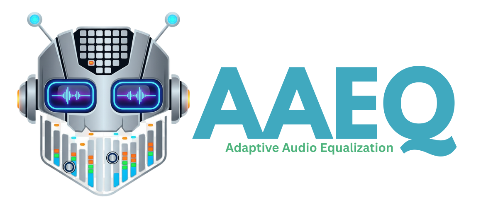
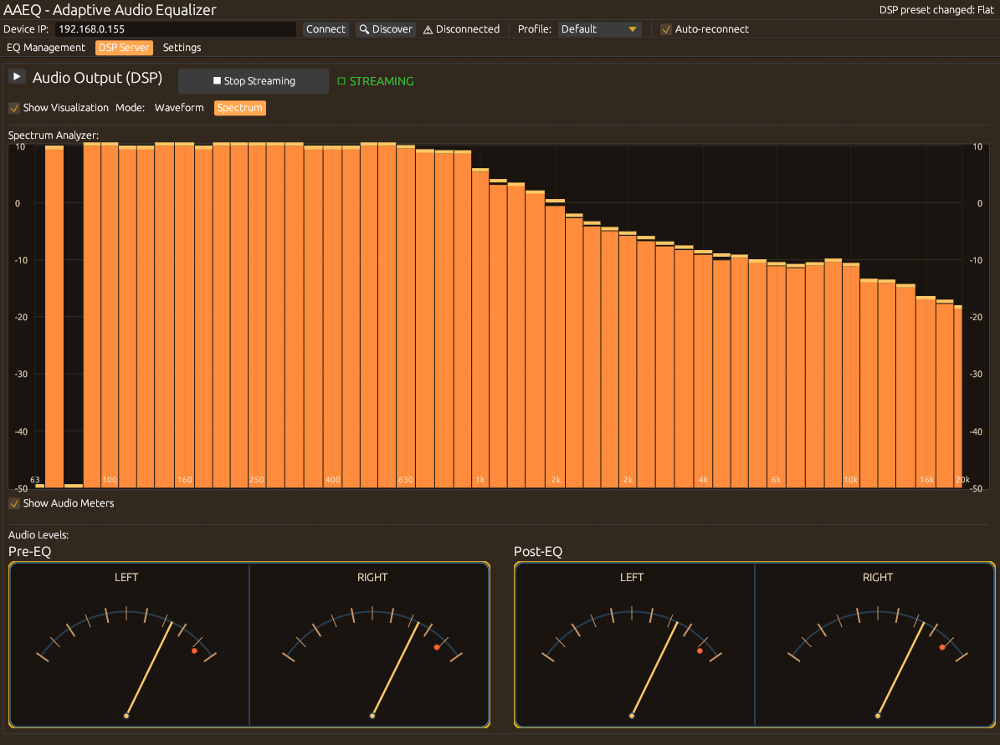

<p align="center">
  
</p>

<p align="center">
  <a href="https://github.com/jaschadub/AAEQ/actions"></a>
  <a href="LICENSE"></a>
</p>

<p align="center">
  <strong>Automatically apply per-song, album, or genre EQ presets to your network audio devices. Stream your computer's audio with professional-grade DSP processing.</strong>
</p>

AAEQ is a cross-platform desktop application that intelligently manages EQ settings on your WiiM (LinkPlay) and DLNA devices based on what's currently playing. It also features a powerful DSP streaming mode with professional audio processing: high-quality resampling, dithering & noise shaping, parametric EQ, and real-time visualization. Set your favorite EQ preset once per song, album, or genre, and AAEQ will remember and apply it automatically.

<table>
  <tr>
    <td width="50%">
      
      <p align="center"><em>EQ Management Mode</em></p>
    </td>
    <td width="50%">
      
      <p align="center"><em>DSP Streaming Mode with Vintage Theme</em></p>
    </td>
  </tr>
</table>

## Features

### EQ Management Mode
- **Smart EQ Switching** - Automatically applies EQ based on song → album → genre → default priority
- **Manual Genre Editing** - Add genres to tracks that don't have metadata
- **WiiM/LinkPlay Support** - Works with WiiM Mini, Pro, Ultra, and other LinkPlay-based devices
- **DLNA Support** - Discover and control DLNA/UPnP media renderers
- **Now Playing Detection** - Cross-platform support for all major streaming services
  - **Linux**: MPRIS (Spotify, Strawberry, VLC, browsers, etc.)
  - **Windows**: SMTC (Spotify, Tidal, iTunes, browsers, etc.)
  - **macOS**: All apps with `nowplayingctl` (Spotify, Tidal, YouTube Music, etc.)
- **Album Art Display** - Shows album artwork for the currently playing track with default fallback icon
- **EQ Curve Visualization** - View exact EQ curves for both built-in and custom presets

### DSP Streaming Mode
- **Real-Time Audio Processing** - Capture system audio with professional DSP chain
- **Custom EQ Presets** - Create, save, and manage unlimited custom EQ presets in database
- **10-Band Parametric EQ** - Precise control with traditional sliders or graphical Bezier curve editor
- **High-Quality Resampling** - Professional sinc-based sample rate conversion with 4 quality presets (Fast, Balanced, High, Ultra)
- **Dithering & Noise Shaping** - Industry-standard TPDF dithering with 4 noise shaping algorithms for pristine bit depth reduction
- **Pipeline Visualization** - Real-time DSP pipeline display showing all processing stages (Input → Headroom → EQ → Resample → Dither → Output)
- **Multi-Format Streaming** - Stream to DLNA devices (with album art), local DAC, or AirPlay (experimental)
- **Format Conversion** - Supports S16LE, S24LE, F32 with configurable sample rates (44.1kHz - 192kHz)
- **Real-Time Visualization** - Live waveform or spectrum analyzer with FFT-based frequency analysis
- **Audio Meters** - Professional VU-style meters with peak hold showing pre/post-EQ levels in dBFS
- **Now Playing Integration** - Cross-platform detection of currently playing media (all streaming services supported)
- **Device Persistence** - Remembers last used input/output devices and DSP settings between sessions
- **Profile-Based DSP Settings** - Each profile can have its own DSP configuration (headroom, EQ, resampling, dithering)
- **Auto-Resize Window** - Window automatically adjusts to fit visualization and meters when enabled

### General
- **Multiple Profiles** - Create separate EQ mapping profiles (e.g., "Headphones", "Speakers", "Living Room")
- **Profile Switching** - Instantly switch between profiles to apply different EQ settings for the same songs
- **Theme System** - 5 color themes: Dark, Light, WinAmp, Vintage, and Studio
- **Settings Tab** - Theme selection, database backup/restore, and about information
- **Local-First** - All data stored locally in SQLite, no cloud required
- **Fast & Lightweight** - Built in Rust with minimal resource usage
- **Cross-Platform** - Runs on Linux, macOS, and Windows
- **Smart Connection Management** - Toggle between Connect/Disconnect states with auto-reconnect

## Streaming Service Support

AAEQ supports **all major streaming services** across all platforms:

| Service | Linux | Windows | macOS |
|---------|-------|---------|-------|
| **Spotify** | ✅ | ✅ | ✅ |
| **Tidal** | ✅ | ✅ | ✅ * |
| **YouTube Music** | ✅ | ✅ | ✅ * |
| **Amazon Music** | ✅ | ✅ | ✅ * |
| **Apple Music** | ✅ | ✅ | ✅ |
| **Deezer** | ✅ | ✅ | ✅ * |
| **And many more...** | ✅ | ✅ | ✅ * |

**\* macOS Note**: For full compatibility with all streaming services (Tidal, YouTube Music, etc.), install `nowplayingctl`:
```bash
brew install nowplayingctl
```
Without this tool, only Music.app and Spotify are supported via AppleScript fallback.

📖 See [Streaming Service Support Guide](docs/STREAMING_SERVICE_SUPPORT.md) for detailed compatibility information.

## Installation

### Download Pre-built Binaries

Download the latest release for your platform:

- **Linux**: `aaeq-linux-x64.tar.gz`
- **macOS**: `aaeq-macos-universal.dmg`
- **Windows**: `aaeq-windows-x64.msi` (installer) or `aaeq-windows-x64.zip` (portable)

[→ Latest Releases](https://github.com/jaschadub/AAEQ/releases)

### Build from Source

#### Prerequisites

**All Platforms:**
- Rust 1.75+ (stable)

**Linux:**
- GTK3 development libraries
- libxdo (for system tray support)
- libappindicator3 (for system tray support)
- ALSA development libraries (for audio capture/DSP)
- D-Bus (for MPRIS integration)

```bash
# Ubuntu/Debian
sudo apt install libgtk-3-dev libxdo-dev libappindicator3-dev libasound2-dev dbus

# Arch Linux/Manjaro
sudo pacman -S gtk3 xdotool libappindicator-gtk3 alsa-lib dbus
```

**macOS:**
- No additional dependencies required for basic functionality
- **Optional but recommended**: `nowplayingctl` for universal streaming service support (Tidal, YouTube Music, etc.)
  ```bash
  brew install nowplayingctl
  ```
  Without this tool, only Music.app and Spotify are supported for Now Playing detection.

**Windows:**
- No additional dependencies required

#### Build Steps

```bash
# Install Rust (if not already installed)
curl --proto '=https' --tlsv1.2 -sSf https://sh.rustup.rs | sh

# Clone and build
git clone https://github.com/jaschadub/AAEQ.git
cd AAEQ
cargo build --release

# Run
./target/release/aaeq
```

## Quick Start

### Using EQ Management Mode (WiiM API)

1. **Connect to your WiiM device**
   - Enter your device's IP address (e.g., `192.168.1.100`)
   - Click "Connect"

2. **Load presets from device**
   - Click "Refresh from Device" to see available EQ presets

3. **Create mappings**
   - Play a song on your WiiM device
   - Select an EQ preset from the list
   - Click "Apply Selected Preset"
   - Click "This Song", "This Album", or "This Genre" to save the mapping

4. **Enjoy automatic EQ switching!**
   - AAEQ will now automatically apply your saved presets when tracks change

### Using DSP Streaming Mode

1. **Set up audio capture** (Linux only, first time)
   - Run the included setup script: `./setup-audio-loopback.sh`
   - Or see [AUDIO_CAPTURE_SETUP.md](AUDIO_CAPTURE_SETUP.md) for manual setup
   - This creates a virtual audio device that captures your system audio

2. **Switch to DSP tab**
   - Click the "DSP" tab in the application

3. **Select input device**
   - Choose your audio input device from the dropdown
   - For system audio capture, select the loopback device you created
   - Your selection is automatically saved for next time

4. **Discover output devices**
   - Click "Discover Devices" to find DLNA devices on your network
   - Or select "Local DAC" to output to your computer's speakers/headphones

5. **Configure DSP (optional)**
   - Adjust EQ bands, compression, limiting as desired
   - Enable/disable individual effects
   - See real-time audio visualization

6. **Start streaming**
   - Select a discovered device and click "Start Streaming"
   - Your computer's audio will be processed and streamed to the selected device
   - Now Playing will show what's currently playing (all platforms supported)

7. **Apply EQ presets**
   - EQ mappings work in DSP mode too!
   - The app detects what's playing locally and applies the mapped preset

For technical details on how AAEQ works, see [How It Works](docs/how-it-works.md).

## Manual Genre Support

Since many streaming services don't provide genre metadata via the WiiM API, AAEQ includes a manual genre editor:

1. Click on the genre field in "Now Playing"
2. Type the genre (e.g., "Rock", "Jazz", "Classical")
3. Press Enter to save - the genre persists across app restarts
4. Use the ↻ button to reset to device-provided genre (if available)

## Multiple Profiles

AAEQ supports multiple EQ profiles, allowing you to maintain different EQ mappings for different listening scenarios:

### Use Cases
- **Headphones** - Bright EQ for detailed listening
- **Speakers** - Balanced EQ for room acoustics
- **Living Room** - Bass-heavy EQ for ambient noise
- **Night** - Reduced dynamics for quiet listening

### Managing Profiles

1. **Create a new profile**
   - Click the profile dropdown in the top-left
   - Select "➕ New Profile"
   - Enter a name (e.g., "Headphones")

2. **Switch between profiles**
   - Select a profile from the dropdown
   - EQ mappings update instantly
   - The currently playing track applies the new profile's preset

3. **Each profile has its own mappings**
   - Same song can have different EQ in different profiles
   - For example: "Song A" → "Bass Booster" in "Living Room" profile
   - But "Song A" → "Flat" in "Headphones" profile

4. **Built-in profiles**
   - "Default" profile is created automatically
   - Built-in profiles cannot be deleted
   - You can rename and delete user-created profiles

### How It Works

When you switch profiles:
1. AAEQ loads the mappings for the new profile
2. If a track is currently playing, it re-resolves the preset using the new profile's mappings
3. The new preset is applied automatically
4. Your active profile persists across app restarts

For development instructions and project structure, see [Development Guide](docs/development.md).

For configuration details, see [Configuration](docs/configuration.md).

## Contributing

Contributions are welcome! Please:

1. Fork the repository
2. Create a feature branch (`git checkout -b feature/amazing-feature`)
3. Commit your changes (`git commit -m 'Add amazing feature'`)
4. Push to the branch (`git push origin feature/amazing-feature`)
5. Open a Pull Request

## Known Limitations

### WiiM API Mode
- **WiiM API Constraints**:
  - Can only apply WiiM's built-in EQ presets via the API
  - Custom EQ presets work only in DSP Streaming Mode
  - Genre metadata often missing from streaming services
  - Metadata encoding issues with some sources (handled via hex decoding)

### DSP Streaming Mode
- **Platform Support**:
  - Audio capture best supported on Linux (ALSA/PulseAudio)
  - macOS and Windows support planned but not yet fully tested
  - **Now Playing detection**: ✅ Fully supported on all platforms
    - Linux: MPRIS (all media players)
    - Windows: SMTC (all modern apps including Tidal, Spotify, etc.)
    - macOS: System-wide with `nowplayingctl` (recommended), AppleScript fallback for Music.app and Spotify

- **Device Compatibility**:
  - **DLNA streaming**: ✅ Tested and working with WiiM devices and most UPnP renderers
  - **Local DAC output**: ✅ Fully supported with high-quality audio processing
  - **AirPlay support**: ⚠️ **Limited compatibility**
    - ❌ **Apple AirPlay 2 devices NOT supported** (HomePod, Apple TV, AirPort Express)
      - These require MFi (Made for iPhone) hardware authentication chip
      - Cannot be implemented in software without violating Apple's licensing terms
      - Device verification is mandatory from tvOS 10.2+ and equivalent firmware
    - ✅ **Third-party AirPlay 1 speakers MAY work** (Sonos, Bose, etc.)
      - Many third-party speakers use AirPlay 1 protocol without MFi requirement
      - Compatibility varies by manufacturer
    - 💡 **Recommended alternatives**:
      - Use DLNA output (most network speakers support both AirPlay and DLNA)
      - Use Local DAC output for computer audio
      - Many speakers list both AirPlay and DLNA in their specs
  - Some DLNA devices may have specific format requirements

- **Performance**:
  - DSP processing is CPU-intensive; older systems may experience latency
  - Network streaming quality depends on WiFi strength
  - Buffer sizes are auto-tuned but may need manual adjustment for some devices

- **Audio Quality (Local DAC)**:
  - ✅ Buffer pre-fill prevents startup hissing/clicks
  - ✅ Automatic sample rate detection with mismatch warnings
  - ✅ Support for F32 (32-bit float), S24LE (24-bit), and S16LE (16-bit) output
  - ✅ Professional dithering: TPDF (Triangular), Rectangular, Gaussian with 4 noise shaping algorithms
  - ✅ High-quality resampling: Sinc-based interpolation with 4 quality presets (Fast to Ultra)
  - ✅ Configurable sample rates (44.1kHz - 192kHz) with on-the-fly conversion
  - ✅ Buffer underrun detection and logging
  - ✅ Per-profile DSP settings for different listening scenarios

### General
- **System Tray on XFCE**:
  - AAEQ uses libappindicator for the system tray icon, which requires specific XFCE panel plugins
  - **Solution**: Add one of these plugins to your XFCE panel:
    - **Indicator Plugin** (xfce4-indicator-plugin) - Recommended for most apps
    - **Status Notifier Plugin** (xfce4-statusnotifier-plugin) - Modern D-Bus based
    - **Status Tray** (XFCE 4.15+) - Built-in support for statusnotifier items
  - **How to add**: Right-click XFCE panel → Panel → Add New Items → Select "Indicator Plugin" or "Status Notifier Plugin"
  - **Note**: Don't use both Indicator and Status Notifier plugins simultaneously as they conflict
  - The "Notification Area" (systray) plugin only supports legacy XEMBED icons, not libappindicator
  - Works out-of-box on GNOME, KDE, and other desktop environments with native indicator support

## License

This project is licensed under the MIT License - see the [LICENSE](LICENSE) file for details.

## Additional Documentation

- [How It Works](docs/how-it-works.md) - Technical details on EQ management and DSP processing
- [Development Guide](docs/development.md) - Build instructions and project structure
- [Configuration](docs/configuration.md) - Data directory and database schema
- [AUDIO_CAPTURE_SETUP.md](AUDIO_CAPTURE_SETUP.md) - Detailed audio capture setup guide for Linux
- [Streaming Service Support](docs/STREAMING_SERVICE_SUPPORT.md) - Streaming service compatibility guide (Tidal, YouTube Music, etc.)
- [Cross-Platform Media Detection](docs/CROSS_PLATFORM_MEDIA_DETECTION.md) - Technical details on cross-platform Now Playing detection
- [Testing Guide](docs/TESTING_GUIDE.md) - Testing and debugging guide for stream server and DSP features

## Support

- **Issues**: [GitHub Issues](https://github.com/jaschadub/AAEQ/issues)
- **Discussions**: [GitHub Discussions](https://github.com/jaschadub/AAEQ/discussions)

---

## Disclaimer

AAEQ is an independent, open-source project and is not affiliated with, endorsed by, sponsored by, or officially connected with WiiM, LinkPlay, Spotify, Tidal, Apple, DLNA, UPnP, AirPlay, or any other companies, products, or services mentioned in this documentation. All product names, logos, brands, trademarks, and registered trademarks are property of their respective owners. Use of these names, logos, and brands does not imply endorsement.

This software is provided "as is" without warranty of any kind. Users are responsible for ensuring their use of this software complies with all applicable terms of service and licensing agreements.

---


