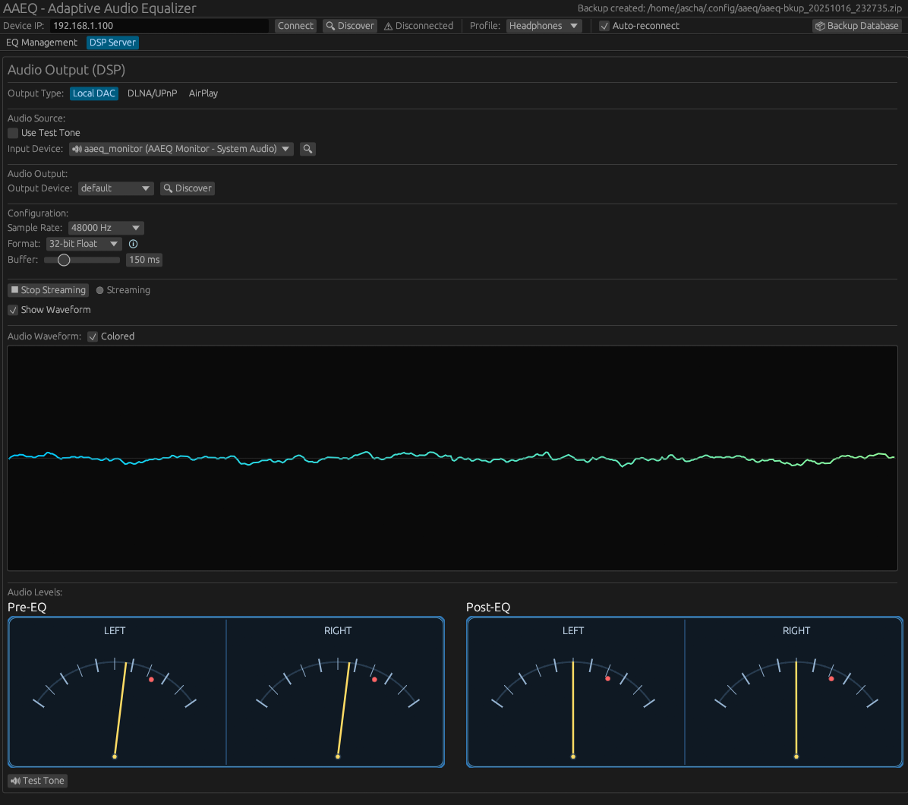

<p align="center">
  
</p>

<p align="center">
  <a href="https://github.com/jaschadub/AAEQ/actions"></a>
  <a href="LICENSE"></a>
</p>

<p align="center">
  <strong>Automatically apply per-song, album, or genre EQ presets to your network audio devices. Stream your computer's audio with real-time DSP processing.</strong>
</p>

AAEQ is a cross-platform desktop application that intelligently manages EQ settings on your WiiM (LinkPlay) and DLNA devices based on what's currently playing. It also features a powerful DSP streaming mode that captures your computer's audio, applies real-time processing, and streams it to network devices. Set your favorite EQ preset once per song, album, or genre, and AAEQ will remember and apply it automatically.

<table>
  <tr>
    <td width="50%">
      
      <p align="center"><em>EQ Management Mode</em></p>
    </td>
    <td width="50%">
      
      <p align="center"><em>DSP Streaming Mode</em></p>
    </td>
  </tr>
</table>

## ✨ Features

### EQ Management Mode
- 🎵 **Smart EQ Switching** - Automatically applies EQ based on song → album → genre → default priority
- 🎛️ **Manual Genre Editing** - Add genres to tracks that don't have metadata
- 🔌 **WiiM/LinkPlay Support** - Works with WiiM Mini, Pro, Ultra, and other LinkPlay-based devices
- 📡 **DLNA Support** - Discover and control DLNA/UPnP media renderers
- 🎯 **Now Playing Detection** - Tracks what's playing on your WiiM device or via MPRIS (Spotify, Strawberry, etc.)
- 🎨 **Album Art Display** - Shows album artwork for the currently playing track with default fallback icon
- 📊 **EQ Curve Visualization** - View exact EQ curves for both built-in and custom presets

### DSP Streaming Mode
- 🎚️ **Real-Time Audio Processing** - Capture system audio with configurable DSP chain
- 🎛️ **Custom EQ Presets** - Create, save, and manage unlimited custom EQ presets in database
- 🎯 **10-Band Parametric EQ** - Precise control over frequency, gain, and Q factor per band
- 📤 **Multi-Format Streaming** - Stream to DLNA devices (with album art), local DAC, or AirPlay (experimental)
- 🎵 **Format Conversion** - Supports S16LE, S24LE, F32 with configurable sample rates (44.1kHz - 192kHz)
- 📊 **Real-Time Visualization** - Live waveform display and dual audio level meters (pre/post EQ)
- 📈 **Audio Meters** - Professional VU meters showing RMS and peak levels in dBFS
- 🎙️ **MPRIS Integration** - Automatically detects what's playing on Linux media players
- 🔄 **Device Persistence** - Remembers last used input/output devices between sessions
- 🪟 **Auto-Resize Window** - Window automatically adjusts to fit waveform and meters when enabled

### General
- 👤 **Multiple Profiles** - Create separate EQ mapping profiles (e.g., "Headphones", "Speakers", "Car")
- 🔄 **Profile Switching** - Instantly switch between profiles to apply different EQ settings for the same songs
- 💾 **Local-First** - All data stored locally in SQLite, no cloud required
- 🚀 **Fast & Lightweight** - Built in Rust with minimal resource usage
- 🖥️ **Cross-Platform** - Runs on Linux, macOS, and Windows
- 🔌 **Smart Connection Management** - Toggle between Connect/Disconnect states with auto-reconnect

## 📥 Installation

### Download Pre-built Binaries

Download the latest release for your platform:

- **Linux**: `aaeq-linux-x64.tar.gz`
- **macOS**: `aaeq-macos-universal.dmg`
- **Windows**: `aaeq-windows-x64.zip`

[→ Latest Releases](https://github.com/jaschadub/AAEQ/releases)

### Build from Source

#### Prerequisites

**All Platforms:**
- Rust 1.75+ (stable)

**Linux:**
- GTK3 development libraries
- libxdo (for system tray support)
- libappindicator3 (for system tray support)
- ALSA development libraries (for audio capture/DSP)
- D-Bus (for MPRIS integration)

```bash
# Ubuntu/Debian
sudo apt install libgtk-3-dev libxdo-dev libappindicator3-dev libasound2-dev dbus

# Arch Linux/Manjaro
sudo pacman -S gtk3 xdotool libappindicator-gtk3 alsa-lib dbus
```

**macOS:**
- No additional dependencies required

**Windows:**
- No additional dependencies required

#### Build Steps

```bash
# Install Rust (if not already installed)
curl --proto '=https' --tlsv1.2 -sSf https://sh.rustup.rs | sh

# Clone and build
git clone https://github.com/jaschadub/AAEQ.git
cd AAEQ
cargo build --release

# Run
./target/release/aaeq
```

## 🚀 Quick Start

### Using EQ Management Mode (WiiM API)

1. **Connect to your WiiM device**
   - Enter your device's IP address (e.g., `192.168.1.100`)
   - Click "Connect"

2. **Load presets from device**
   - Click "Refresh from Device" to see available EQ presets

3. **Create mappings**
   - Play a song on your WiiM device
   - Select an EQ preset from the list
   - Click "Apply Selected Preset"
   - Click "This Song", "This Album", or "This Genre" to save the mapping

4. **Enjoy automatic EQ switching!**
   - AAEQ will now automatically apply your saved presets when tracks change

### Using DSP Streaming Mode

1. **Set up audio capture** (Linux only, first time)
   - Run the included setup script: `./setup-audio-loopback.sh`
   - Or see [AUDIO_CAPTURE_SETUP.md](AUDIO_CAPTURE_SETUP.md) for manual setup
   - This creates a virtual audio device that captures your system audio

2. **Switch to DSP tab**
   - Click the "DSP" tab in the application

3. **Select input device**
   - Choose your audio input device from the dropdown
   - For system audio capture, select the loopback device you created
   - Your selection is automatically saved for next time

4. **Discover output devices**
   - Click "Discover Devices" to find DLNA devices on your network
   - Or select "Local DAC" to output to your computer's speakers/headphones

5. **Configure DSP (optional)**
   - Adjust EQ bands, compression, limiting as desired
   - Enable/disable individual effects
   - See real-time audio visualization

6. **Start streaming**
   - Select a discovered device and click "Start Streaming"
   - Your computer's audio will be processed and streamed to the selected device
   - Now Playing will show what's currently playing (via MPRIS on Linux)

7. **Apply EQ presets**
   - EQ mappings work in DSP mode too!
   - The app detects what's playing locally and applies the mapped preset

## 📖 How It Works

### EQ Management Mode

AAEQ polls your WiiM device every second to check what's currently playing. When a track changes, it:

1. Checks for a **song-specific** mapping (`Artist - Title`)
2. Falls back to **album mapping** (`Artist - Album`)
3. Falls back to **genre mapping** (if genre is set)
4. Falls back to **default preset** (usually "Flat")

The resolved preset is only applied if it's different from the currently active one, preventing unnecessary device commands.

### DSP Streaming Mode

In DSP mode, AAEQ:

1. **Captures audio** from your selected input device (microphone, line-in, or system audio loopback)
2. **Applies DSP processing** in real-time:
   - Parametric EQ (up to 10 bands)
   - Compression and limiting
   - Bass/treble enhancement
   - Stereo width adjustment
3. **Converts format** to the target sample rate and bit depth
4. **Streams to network device** via DLNA/UPnP protocol, or outputs to local DAC
5. **Detects Now Playing** via MPRIS (on Linux) to show what's actually playing
6. **Applies EQ presets** automatically based on the detected track (same mapping logic as WiiM API mode)

The DSP mode works independently of WiiM devices - you can stream any audio source to any DLNA-compatible device.

## 🎛️ Manual Genre Support

Since many streaming services don't provide genre metadata via the WiiM API, AAEQ includes a manual genre editor:

1. Click on the genre field in "Now Playing"
2. Type the genre (e.g., "Rock", "Jazz", "Classical")
3. Press Enter to save - the genre persists across app restarts
4. Use the ↻ button to reset to device-provided genre (if available)

## 👤 Multiple Profiles

AAEQ supports multiple EQ profiles, allowing you to maintain different EQ mappings for different listening scenarios:

### Use Cases
- **Headphones** - Bright EQ for detailed listening
- **Speakers** - Balanced EQ for room acoustics
- **Car** - Bass-heavy EQ for road noise
- **Night** - Reduced dynamics for quiet listening

### Managing Profiles

1. **Create a new profile**
   - Click the profile dropdown in the top-left
   - Select "➕ New Profile"
   - Enter a name (e.g., "Headphones")

2. **Switch between profiles**
   - Select a profile from the dropdown
   - EQ mappings update instantly
   - The currently playing track applies the new profile's preset

3. **Each profile has its own mappings**
   - Same song can have different EQ in different profiles
   - For example: "Song A" → "Bass Booster" in "Car" profile
   - But "Song A" → "Flat" in "Headphones" profile

4. **Built-in profiles**
   - "Default" profile is created automatically
   - Built-in profiles cannot be deleted
   - You can rename and delete user-created profiles

### How It Works

When you switch profiles:
1. AAEQ loads the mappings for the new profile
2. If a track is currently playing, it re-resolves the preset using the new profile's mappings
3. The new preset is applied automatically
4. Your active profile persists across app restarts

## 📁 Project Structure

```
AAEQ/
├── apps/
│   └── desktop/          # Main desktop application
├── crates/
│   ├── core/             # Core logic and models
│   ├── device-wiim/      # WiiM device integration
│   ├── persistence/      # SQLite database layer
│   ├── stream-server/    # DSP engine and streaming
│   └── ui-egui/          # egui-based UI with DSP controls
├── docs/                 # Implementation documentation
├── migrations/           # Database migrations
└── setup-audio-loopback.sh  # Audio capture setup script
```

## 🛠️ Development

### Prerequisites

- Rust 1.75+ (stable)
- SQLite development libraries
- **Linux only**: GTK3, libxdo, and libappindicator3 (see Build from Source section)

### Running in Development

```bash
cargo run
```

### Running Tests

```bash
cargo test
```

### Code Style

```bash
cargo fmt
cargo clippy
```

## 🔧 Configuration

AAEQ stores its configuration and database in:

- **Linux**: `~/.local/share/aaeq/`
- **macOS**: `~/Library/Application Support/aaeq/`
- **Windows**: `%APPDATA%\aaeq\`

### Database Schema

- `device` - Connected devices
- `device_preset` - Cached presets from devices
- `profile` - User-created EQ profiles (e.g., "Headphones", "Speakers")
- `mapping` - Song/album/genre → preset mappings (scoped per profile)
- `genre_override` - Manual genre assignments
- `last_applied` - Tracking state for debouncing
- `app_settings` - Application settings (last connected device, last input/output devices, active profile)
- `custom_eq_preset` - User-created custom EQ presets
- `custom_eq_band` - EQ band definitions for custom presets

## 🤝 Contributing

Contributions are welcome! Please:

1. Fork the repository
2. Create a feature branch (`git checkout -b feature/amazing-feature`)
3. Commit your changes (`git commit -m 'Add amazing feature'`)
4. Push to the branch (`git push origin feature/amazing-feature`)
5. Open a Pull Request

## 🐛 Known Limitations

### WiiM API Mode
- **WiiM API Constraints**:
  - Can only apply WiiM's built-in EQ presets via the API
  - Custom EQ presets work only in DSP Streaming Mode
  - Genre metadata often missing from streaming services
  - Metadata encoding issues with some sources (handled via hex decoding)

### DSP Streaming Mode
- **Platform Support**:
  - Audio capture best supported on Linux (ALSA/PulseAudio)
  - macOS and Windows support planned but not yet fully tested
  - MPRIS integration (Now Playing detection) only works on Linux

- **Device Compatibility**:
  - DLNA streaming tested with WiiM devices and most UPnP renderers
  - AirPlay support is experimental and may not work with all devices
  - Some DLNA devices may have specific format requirements

- **Performance**:
  - DSP processing is CPU-intensive; older systems may experience latency
  - Network streaming quality depends on WiFi strength
  - Buffer sizes are auto-tuned but may need manual adjustment for some devices

### General
- **System Tray on XFCE**:
  - AAEQ uses libappindicator for the system tray icon, which requires specific XFCE panel plugins
  - **Solution**: Add one of these plugins to your XFCE panel:
    - **Indicator Plugin** (xfce4-indicator-plugin) - Recommended for most apps
    - **Status Notifier Plugin** (xfce4-statusnotifier-plugin) - Modern D-Bus based
    - **Status Tray** (XFCE 4.15+) - Built-in support for statusnotifier items
  - **How to add**: Right-click XFCE panel → Panel → Add New Items → Select "Indicator Plugin" or "Status Notifier Plugin"
  - **Note**: Don't use both Indicator and Status Notifier plugins simultaneously as they conflict
  - The "Notification Area" (systray) plugin only supports legacy XEMBED icons, not libappindicator
  - Works out-of-box on GNOME, KDE, and other desktop environments with native indicator support

## 📝 License

This project is licensed under the MIT License - see the [LICENSE](LICENSE) file for details.

## 🙏 Acknowledgments

- Built with [egui](https://github.com/emilk/egui) for the UI
- Audio processing powered by [cpal](https://github.com/RustAudio/cpal) and custom DSP algorithms
- DLNA/UPnP discovery and control implementation
- MPRIS integration for Linux media player detection
- WiiM/LinkPlay API documentation
- Rust community for excellent crates and tools

## 📚 Additional Documentation

- [AUDIO_CAPTURE_SETUP.md](AUDIO_CAPTURE_SETUP.md) - Detailed audio capture setup guide for Linux
- [docs/STREAM_SERVER_IMPLEMENTATION.md](docs/STREAM_SERVER_IMPLEMENTATION.md) - DSP engine architecture
- [docs/M2_DLNA_IMPLEMENTATION.md](docs/M2_DLNA_IMPLEMENTATION.md) - DLNA/UPnP implementation details
- [docs/TESTING_GUIDE.md](docs/TESTING_GUIDE.md) - Testing and debugging guide

## 📞 Support

- **Issues**: [GitHub Issues](https://github.com/jaschadub/AAEQ/issues)
- **Discussions**: [GitHub Discussions](https://github.com/jaschadub/AAEQ/discussions)
